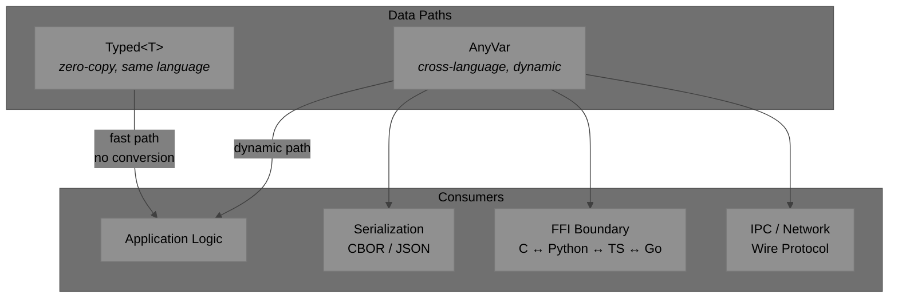
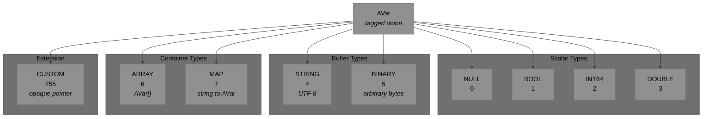
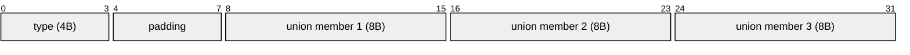
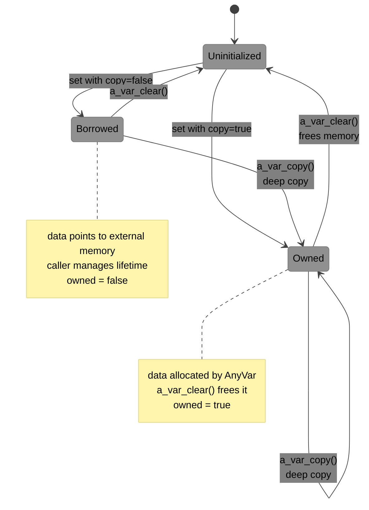
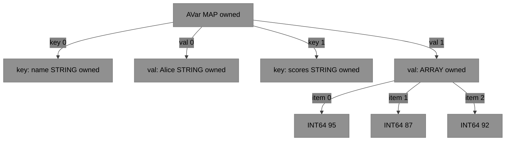
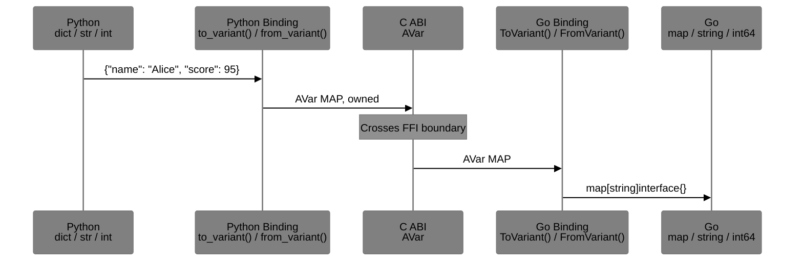
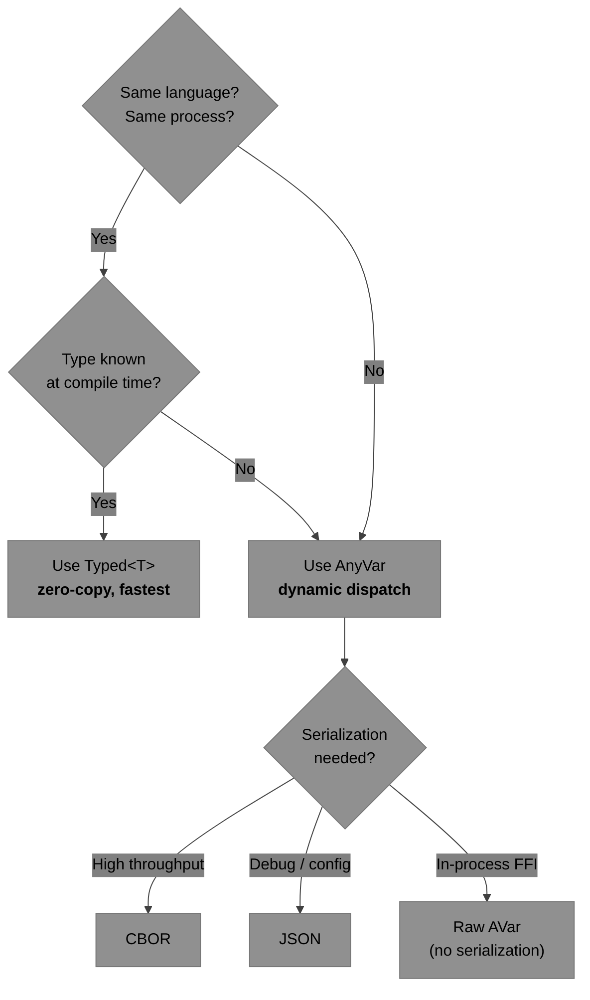
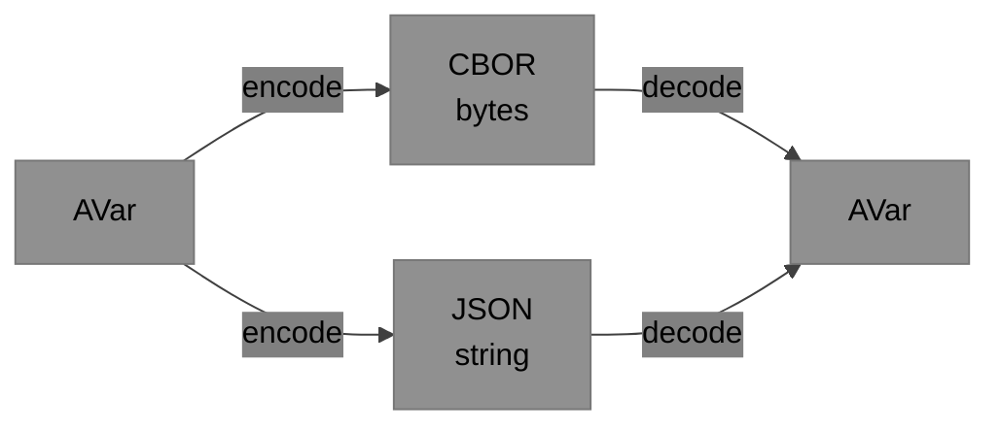
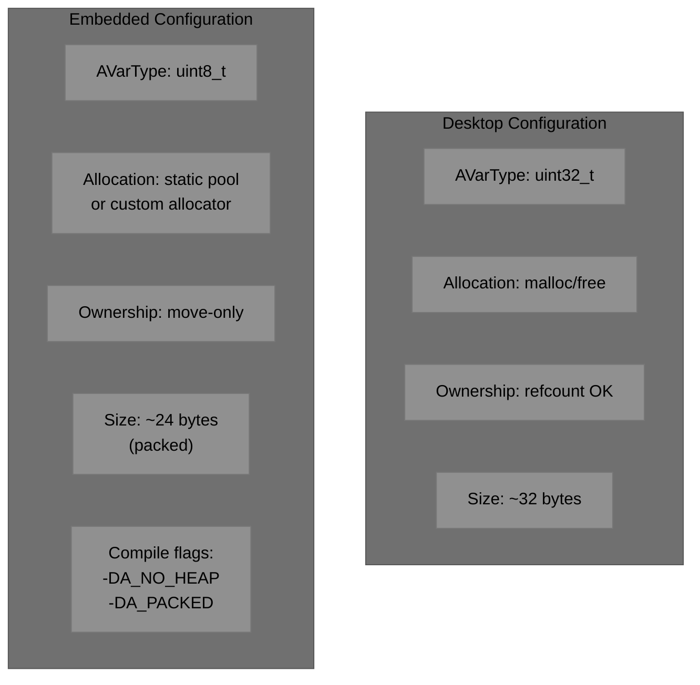

# AnyVar Specification

**Version:** 0.1.0 (Draft)
**Date:** April 2026
**Purpose:** A canonical cross-language, C-ABI-compatible tagged union (variant) for any system requiring lightweight dynamic values across language boundaries.

---

## 1. Introduction

AnyVar (`AVar`) is a lightweight, dynamic value type designed for:

- Cross-language data exchange
- Serialization / deserialization
- Dynamic / heterogeneous data flows
- FFI boundaries between C, C++, Python, TypeScript, Go, and more

It is designed to be:

- **Skinny** — minimal memory footprint
- **Fast** — low overhead for dynamic paths
- **Embedded-friendly** — works on FreeRTOS, Zephyr, and other constrained environments
- **C ABI stable** — safe for FFI across C, C++, Python, JavaScript/TypeScript, Go, PHP, etc.
- **Simple ownership** — easy to reason about in real-time and embedded code

> **Native typed paths** (same-language, high-performance) should bypass AnyVar entirely and use language-native generics/templates where possible.

### Where AnyVar Fits



---

## 2. Type System

### Type Hierarchy



### Type Tags

| Tag | Name | Value | C Union Member | Size |
|---|---|---|---|---|
| `A_NULL` | No value | `0` | *(none)* | 0 |
| `A_BOOL` | Boolean | `1` | `bool b` | 1 byte |
| `A_INT64` | 64-bit integer | `2` | `int64_t i64` | 8 bytes |
| `A_DOUBLE` | 64-bit float | `3` | `double d` | 8 bytes |
| `A_STRING` | UTF-8 text | `4` | `str { data, len, owned }` | ptr + size_t + bool |
| `A_BINARY` | Byte buffer | `5` | `str { data, len, owned }` | ptr + size_t + bool |
| `A_ARRAY` | Variant array | `6` | `array { items, len }` | ptr + size_t |
| `A_MAP` | String→Variant map | `7` | `map { keys, values, len }` | 2 ptrs + size_t |
| `A_CUSTOM` | User extension | `255` | `void* custom` | ptr |

---

## 3. Exact C ABI Definition

```c
/* AnyVar — Lightweight Tagged Union
 * Canonical C ABI representation.
 * All language bindings must map to/from this layout.
 */

typedef enum AVarType {
    A_NULL     = 0,     /* no value */
    A_BOOL     = 1,
    A_INT64    = 2,
    A_DOUBLE   = 3,
    A_STRING   = 4,     /* UTF-8 encoded text */
    A_BINARY   = 5,     /* arbitrary byte buffer */
    A_ARRAY    = 6,     /* homogeneous or heterogeneous array of AVar */
    A_MAP      = 7,     /* string keys → AVar values */
    A_CUSTOM   = 255    /* user-defined extension type */
} AVarType;

typedef struct AVar {
    AVarType type;          /* tag (4 bytes; uint8_t recommended for embedded) */

    union {
        bool          b;         /* A_BOOL */

        int64_t       i64;       /* A_INT64 */

        double        d;         /* A_DOUBLE */

        struct {                 /* A_STRING and A_BINARY */
            char*     data;      /* pointer to buffer (UTF-8 for string) */
            size_t    len;       /* length in bytes */
            bool      owned;     /* true = caller must free this memory */
        } str;

        struct {                 /* A_ARRAY */
            struct AVar* items;
            size_t            len;
        } array;

        struct {                 /* A_MAP */
            struct AVar* keys;   /* array of A_STRING variants */
            struct AVar* values; /* corresponding values */
            size_t            len;
        } map;

        void*         custom;    /* A_CUSTOM — opaque pointer (type via registry) */
    } u;
} AVar;
```

### Memory Layout (64-bit)



> **Typical size:** 24–32 bytes on 64-bit platforms (depending on alignment and whether `type` is `uint32_t` or `uint8_t`).

---

## 4. Layout Guarantees (ABI Stability)

- The struct uses standard C layout rules under `extern "C"`.
- `AVar` is a **standard-layout type**.
- For maximum skinny/embedded use, implementations MAY define `AVarType` as `uint8_t` and apply packing (`#pragma pack(8)` or `__attribute__((packed))`).
- **Never** access `u` members directly unless the `type` field matches the member. Always use helper functions.

---

## 5. Ownership and Lifetime Rules

### Ownership Model



### Rules

1. The `owned` flag (in `str`) indicates whether the memory pointed to by `data` should be freed when the variant is destroyed.
2. For `array` and `map`: ownership is **recursive** — the container owns its child `AVar` items.
3. Default creation from native data SHOULD set `owned = false` (borrow semantics) unless the caller explicitly requests a copy.
4. Destruction function: `a_var_clear(AVar* v)` MUST free memory only when `owned == true` (or recursively for containers).
5. Embedded systems SHOULD support custom allocators via global hooks or per-variant context.

### Container Ownership (Recursive)



> `a_var_clear(&map)` recursively frees keys → values → array items.

---

## 6. Recommended Helper API (C Layer)

```c
/* Initialization */
void a_var_init_null(AVar* v);

/* Scalar setters */
void a_var_set_bool(AVar* v, bool value);
void a_var_set_i64(AVar* v, int64_t value);
void a_var_set_double(AVar* v, double value);

/* Buffer setters (copy=true for owned, copy=false for borrowed) */
void a_var_set_string(AVar* v, const char* str, bool copy);
void a_var_set_binary(AVar* v, const void* data, size_t len, bool copy);

/* Lifecycle */
void a_var_clear(AVar* v);            /* reset and free if owned */
AVar a_var_copy(const AVar* src); /* deep copy */
```

Each language binding MUST provide idiomatic equivalents (e.g., `to_variant()`, `from_variant()`).

### Language Binding Pattern



---

## 7. Usage Guidelines

### When to Use Each Data Path



### Guidelines

| Scenario | Recommendation |
|---|---|
| Hot loop, same language | **Typed path** — avoid AnyVar entirely |
| Cross-language FFI | **AnyVar** via C ABI |
| Wire protocol / IPC | **AnyVar** → CBOR |
| Configuration files | **AnyVar** → JSON |
| User-defined complex types | **A_CUSTOM** + type registry |

---

## 8. Serialization Recommendations

| Format | Use Case | Pros | Cons |
|---|---|---|---|
| **CBOR** | Wire format (default) | IETF standard (RFC 8949), compact, self-describing, deterministic mode, semantic tags | Binary (not human-readable) |
| **JSON** | Debug / config | Human-readable, universal | Verbose, slow for high throughput |

### Serialization Flow



---

## 9. Embedded Considerations

### Platform Configuration



### Compile-Time Flags

| Flag | Effect |
|---|---|
| `A_NO_HEAP` | Disable heap allocation; use static pools only |
| `A_PACKED` | Apply struct packing for minimal size |
| `A_TYPE_U8` | Use `uint8_t` for `AVarType` instead of `uint32_t` |
| `A_CUSTOM_ALLOC` | Enable custom allocator hooks |
| `A_NO_MAP` | Disable A_MAP type (saves code size on tiny targets) |

---

## 10. Non-Goals

- Full GObject-style dynamic type system (too heavy)
- Built-in transformation / collection functions (keep it skinny)
- Language-specific features (e.g., no C++ `std::variant` in the ABI layer)
- Garbage collection or cycle detection

---

## 11. Implementation Roadmap


### Phase Summary

| Phase | Deliverables | Dependencies |
|---|---|---|
| **1. Core C** | Struct, helpers, scalar + container types, ownership | None |
| **2. Serialization** | CBOR, JSON encode/decode | Phase 1 |
| **3. Bindings** | Python, TypeScript, Go, C++ wrappers | Phase 1 (Phase 2 for serialization tests) |
| **4. Embedded** | Static allocator, packed layout, RTOS integration | Phase 1 |

---

## 12. License

AnyVar is intended to be open source (**MIT/Apache 2.0** recommended).

---

> This specification is standalone. All language implementations (C/C++, Python, TypeScript, Go, etc.) MUST conform to this exact C ABI layout when exposing dynamic values across FFI boundaries.
>
> **Next steps:** Formalize CBOR encoding rules, provide reference implementations in C and Python, add alignment/packing examples for embedded targets.
>
> Contributions and feedback welcome.
