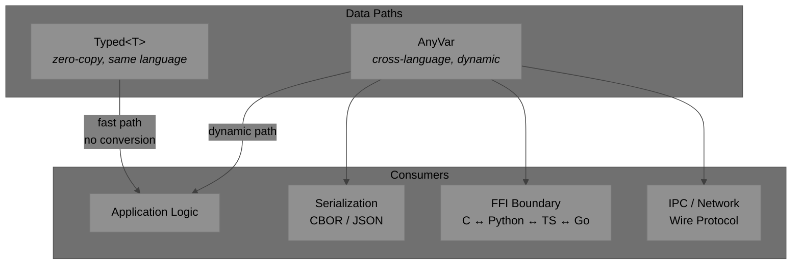
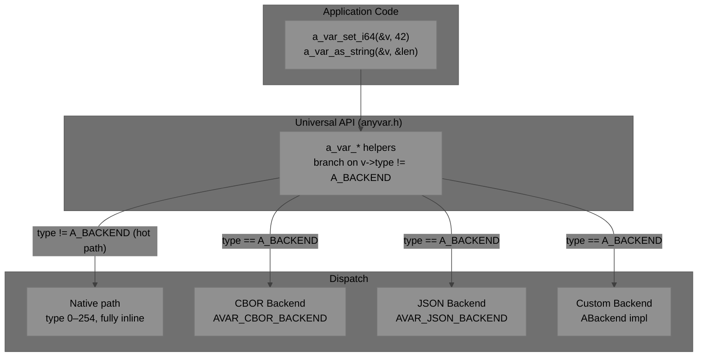
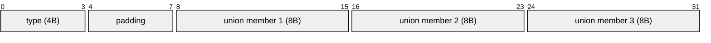
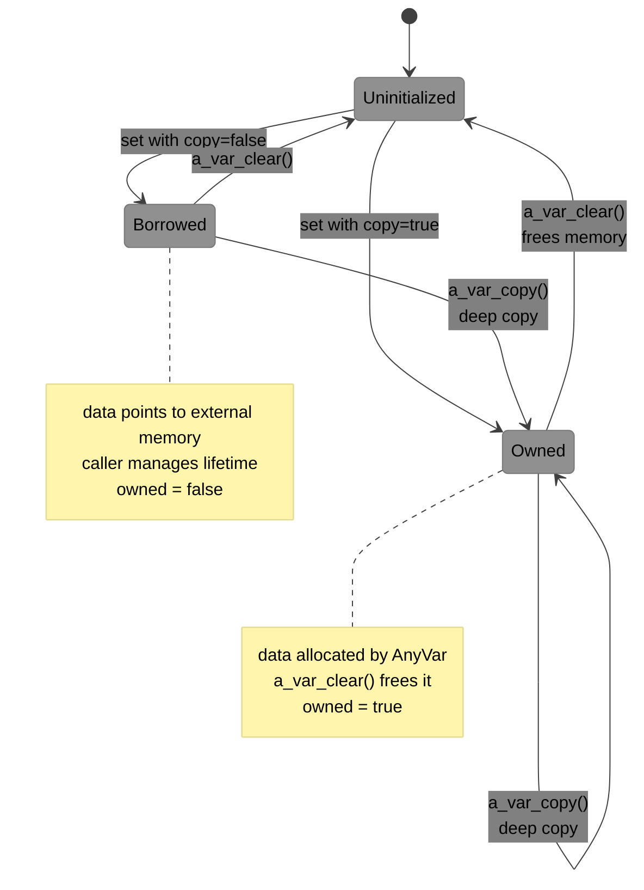
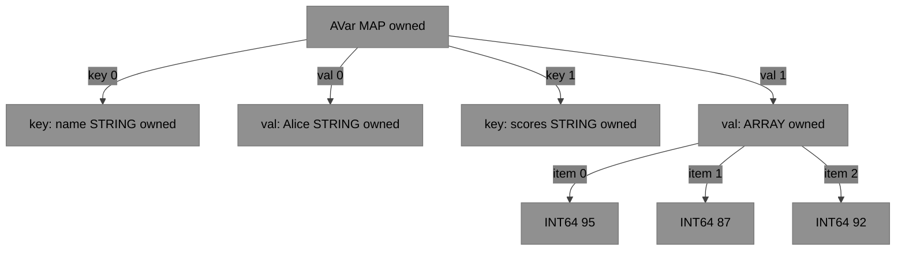
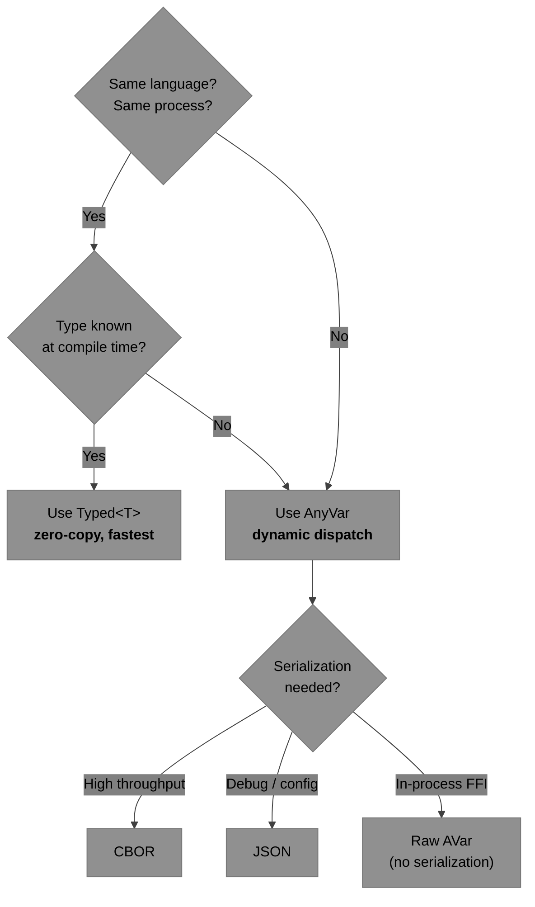
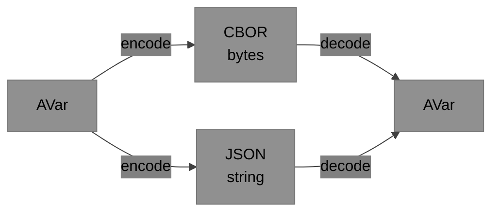
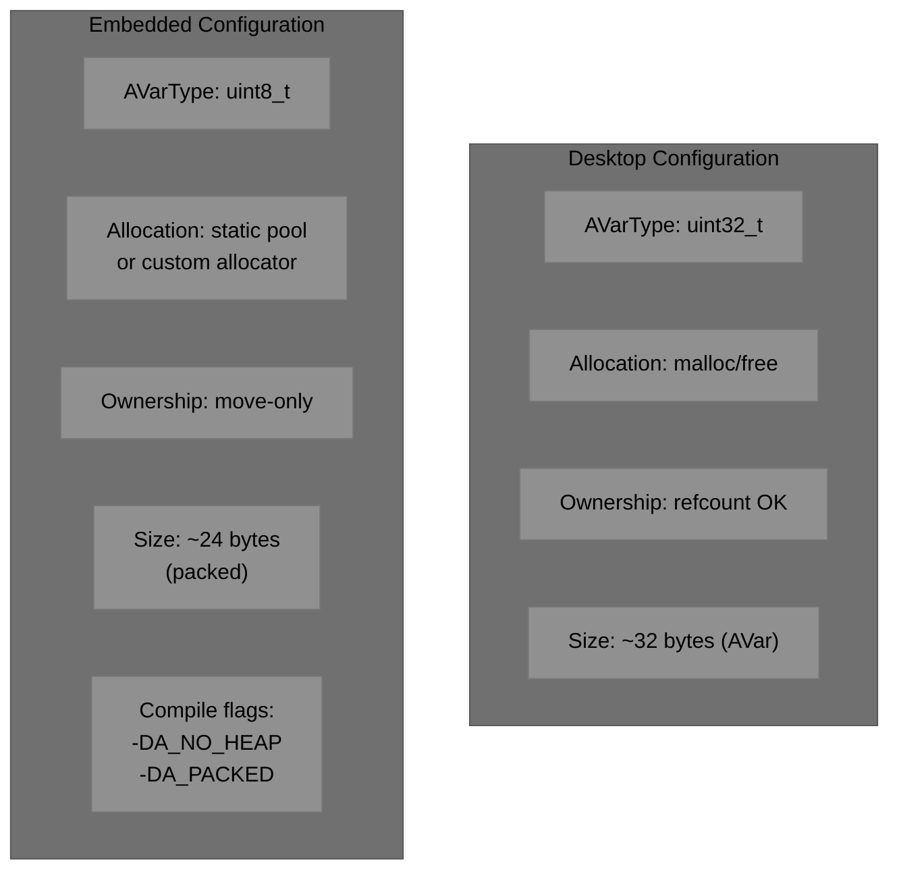

# AnyVar Specification

**Version:** 0.4.0 (Draft)
**Date:** April 2026
**Purpose:** A canonical cross-language, C-ABI-compatible tagged union (variant) for any system requiring lightweight dynamic values across language boundaries.

---

## Related Documents

| Document | Description |
|---|---|
| [docs/c-lib-integration.md](docs/c-lib-integration.md) | How to build and link the C library; binding strategies for 30+ languages including Python, Go, Rust, Node.js, Java, Swift, and WASM |
| [docs/implementation-thoughts.md](docs/implementation-thoughts.md) | Design analysis comparing four backend architectures; rationale for the type-sentinel approach (`A_BACKEND = 255`) |

---

## 1. Introduction

AnyVar (`AVar`) is a lightweight, dynamic value type designed for:

- Cross-language data exchange
- Serialization / deserialization
- Dynamic / heterogeneous data flows
- FFI boundaries between C, C++, Python, TypeScript, Go, and more

It is designed to be:

- **Skinny** — minimal memory footprint
- **Fast** — low overhead for dynamic paths
- **Embedded-friendly** — works on FreeRTOS, Zephyr, and other constrained environments
- **C ABI stable** — safe for FFI across C, C++, Python, JavaScript/TypeScript, Go, PHP, etc.
- **Simple ownership** — easy to reason about in real-time and embedded code
- **Backend-agnostic** — the universal helper API works over any format via pluggable backends; the default backend requires no new API calls or parameters

> **Native typed paths** (same-language, high-performance) should bypass AnyVar entirely and use language-native generics/templates where possible.

### Where AnyVar Fits



---

## 2. Type System

### Type Hierarchy

```mermaid
%%{init: {'theme': 'base', 'themeVariables': { 'primaryColor': '#909090', 'secondaryColor': '#808080', 'tertiaryColor': '#707070', 'primaryTextColor': '#000000', 'secondaryTextColor': '#000000', 'tertiaryTextColor': '#000000', 'noteTextColor': '#000000', 'lineColor': '#404040' }}}%%
graph TD
    AV["AVar<br/><i>tagged union</i>"]
    N["NULL<br/>0x00"]
    B["BOOL<br/>0x01"]

    subgraph "Integer Types  (0x20–0x27)"
        I64["INT64<br/>0x20"]
        U64["UINT64<br/>0x21"]
        I32["INT32<br/>0x22"]
        U32["UINT32<br/>0x23"]
    end

    subgraph "Float Types  (0x28–0x2F)"
        DBL["DOUBLE<br/>0x28"]
        F32["FLOAT32<br/>0x29"]
    end

    subgraph "Buffer Types  (0x40–0x4F)"
        S["STRING<br/>0x40<br/><i>UTF-8</i>"]
        BN["BINARY<br/>0x41<br/><i>arbitrary bytes</i>"]
    end

    subgraph "Container Types  (0x80–0x8F)"
        A["ARRAY<br/>0x80<br/><i>AVar[]</i>"]
        M["MAP<br/>0x81<br/><i>string to AVar</i>"]
    end

    subgraph "Backend Dispatch"
        C["A_BACKEND<br/>0xFF<br/><i>vtable + data*</i>"]
    end

    AV --> N
    AV --> B
    AV --> I64
    AV --> U64
    AV --> I32
    AV --> U32
    AV --> DBL
    AV --> F32
    AV --> S
    AV --> BN
    AV --> A
    AV --> M
    AV --> C
```



### Type Tags

| Tag | Value | C Union Member | Size |
|---|---|---|---|
| `A_NULL` | `0x00` | *(none)* | 0 |
| `A_BOOL` | `0x01` | `bool b` | 1 byte |
| `A_INT64` | `0x20` | `int64_t i64` | 8 bytes |
| `A_UINT64` | `0x21` | `uint64_t u64` | 8 bytes |
| `A_INT32` | `0x22` | `int32_t i32` | 4 bytes |
| `A_UINT32` | `0x23` | `uint32_t u32` | 4 bytes |
| `A_DOUBLE` | `0x28` | `double d` | 8 bytes |
| `A_FLOAT32` | `0x29` | `float f32` | 4 bytes |
| `A_STRING` | `0x40` | `str { data, len, owned }` | ptr + size_t + bool |
| `A_BINARY` | `0x41` | `str { data, len, owned }` | ptr + size_t + bool |
| `A_ARRAY` | `0x80` | `array { items, len }` | ptr + size_t |
| `A_MAP` | `0x81` | `map { keys, values, len }` | 2 ptrs + size_t |
| `A_BACKEND` | `0xFF` | `backend { vtable*, data* }` | 2 ptrs |

The upper nibble encodes the category; within each category the low bits encode subtype:

| Category | Mask | Value | Low bits |
|---|---|---|---|
| Integer | `type & 0xF8 == 0x20` | 0x20–0x27 | bit 1 = 32-bit, bit 0 = unsigned |
| Float | `type & 0xF8 == 0x28` | 0x28–0x2F | bit 0 = 32-bit (FLOAT32) |
| Buffer | `type & 0xF0 == 0x40` | 0x40–0x4F | |
| Container | `type & 0xF0 == 0x80` | 0x80–0x8F | |
| Numeric | `type & 0xF0 == 0x20` | 0x20–0x2F | (integer or float) |

> **Note:** `A_BACKEND = 0xFF` supersedes the earlier `A_CUSTOM` sentinel. Custom extension types are simply backends with their own vtable.

---

## 3. Architecture & C ABI

`AVar` is a **single unified struct** for all paths:

- **Native path** (`type` 0–254) — byte-for-byte identical to the original tagged union layout. No extra fields. No heap allocation for scalars. `v->type` is the first field, readable with a single load and no indirection.
- **Backend path** (`type == A_BACKEND = 255`) — `u.backend` holds a vtable pointer and opaque data pointer. All `a_var_*` helpers detect this with `__builtin_expect(v->type != A_BACKEND, 1)` so the native path is always the hot inline path.

Custom formats (CBOR, JSON, user-defined) are entered explicitly via `a_var_convert()` and are represented as `A_BACKEND` instances. `AVarNative` is retained as a documentation alias (`typedef AVar AVarNative`).



```c
typedef enum AVarType {
    A_NULL      = 0x00,   /* zero-init: AVar v = {0} is a valid null      */
    A_BOOL      = 0x01,

    /* integers  ── (type & 0xF8) == 0x20  ───────────────────────────── */
    /*   bit 1: width   (0 = 64-bit,    1 = 32-bit)                      */
    /*   bit 0: sign    (0 = signed,    1 = unsigned)                    */
    A_INT64     = 0x20,   /* 64-bit signed                               */
    A_UINT64    = 0x21,   /* 64-bit unsigned                             */
    A_INT32     = 0x22,   /* 32-bit signed                               */
    A_UINT32    = 0x23,   /* 32-bit unsigned                             */

    /* floats    ── (type & 0xF8) == 0x28  ───────────────────────────── */
    /*   bit 0: width   (0 = 64-bit,    1 = 32-bit)                      */
    A_DOUBLE    = 0x28,   /* IEEE 754 double (64-bit)                    */
    A_FLOAT32   = 0x29,   /* IEEE 754 single (32-bit)                    */

    /* buffers   ── (type & 0xF0) == 0x40  ───────────────────────────── */
    A_STRING    = 0x40,   /* UTF-8 text                                  */
    A_BINARY    = 0x41,   /* arbitrary bytes                             */

    /* containers── (type & 0xF0) == 0x80  ───────────────────────────── */
    A_ARRAY     = 0x80,
    A_MAP       = 0x81,

    /* 0x02–0x1F, 0x24–0x27, 0x2A–0x3F, 0x42–0x7F, 0x82–0xFE reserved  */
    A_BACKEND   = 0xFF    /* sentinel: u.backend.{vtable, data}          */
} AVarType;

/* ── Category checks — all single bitwise operations ─────────────────── */
#define A_IS_NUMERIC(t)   (((unsigned)(t) & 0xF0u) == 0x20u) /* int or float */
#define A_IS_INTEGER(t)   (((unsigned)(t) & 0xF8u) == 0x20u) /* 0x20–0x27    */
#define A_IS_FLOAT(t)     (((unsigned)(t) & 0xF8u) == 0x28u) /* 0x28–0x2F    */
#define A_IS_BUFFER(t)    (((unsigned)(t) & 0xF0u) == 0x40u) /* 0x40–0x4F    */
#define A_IS_CONTAINER(t) (((unsigned)(t) & 0xF0u) == 0x80u) /* 0x80–0x8F    */
/* Within integer category: */
#define A_IS_UNSIGNED(t)  (A_IS_INTEGER(t) && ((unsigned)(t) & 0x01u))
#define A_IS_32BIT_INT(t) (A_IS_INTEGER(t) && ((unsigned)(t) & 0x02u))
```

### 3.1 The AVar Struct

```c
/* AVar — single unified type for native and backend paths.
 *
 * Native path (type 0–254):
 *   Byte-for-byte identical to the original v0.1 tagged union.
 *   Zero-init is a valid native null:  AVar v = {0};  →  type = A_NULL
 *
 * Backend path (type == A_BACKEND):
 *   u.backend.{vtable, data} dispatch all operations.
 */
typedef struct AVar AVar;
typedef struct ABackend ABackend;

struct AVar {
    AVarType type;        /* first field — always readable, zero indirection  */

    union {
        /* ── Native path ─────────────────────────────────────────────── */
        bool     b;                                       /* A_BOOL          */
        int64_t  i64;                                     /* A_INT64         */
        uint64_t u64;                                     /* A_UINT64        */
        int32_t  i32;                                     /* A_INT32         */
        uint32_t u32;                                     /* A_UINT32        */
        double   d;                                       /* A_DOUBLE        */
        float    f32;                                     /* A_FLOAT32       */

        struct {                                          /* A_STRING/BINARY */
            char*  data;
            size_t len;
            bool   owned;
        } str;

        struct {                                          /* A_ARRAY         */
            struct AVar* items;
            size_t len;
        } array;

        struct {                                          /* A_MAP           */
            struct AVar* keys;
            struct AVar* values;
            size_t len;
        } map;

        /* ── Backend path: type == A_BACKEND ─────────────────────────── */
        struct {
            const ABackend* vtable;
            void*           data;
        } backend;
    } u;
};
```

All `a_var_*` helpers branch on `v->type != A_BACKEND`. The native path is inlined; the backend path is a cold call through the vtable. Never access `u` members directly.

**Helper dispatch pattern:**

```c
static inline AVarType a_var_type(const AVar* v) {
    if (__builtin_expect(v->type != A_BACKEND, 1))
        return v->type;                    /* first field, no indirection */
    return v->u.backend.vtable->get_type(v);
}

static inline void a_var_set_i64(AVar* v, int64_t val) {
    if (__builtin_expect(v->type != A_BACKEND, 1)) {
        v->type  = A_INT64;
        v->u.i64 = val;
        return;
    }
    v->u.backend.vtable->set_i64(v, val);
}
```

### 3.2 Backend Vtable

```c
/* ABackend — interface every backend must implement.
 * All helper functions dispatch through this vtable.
 */
typedef struct ABackend {
    const char* name;               /* e.g. "native", "cbor", "json"        */

    /* type introspection */
    AVarType    (*get_type)    (const AVar* v);

    /* scalar readers */
    bool        (*as_bool)    (const AVar* v);
    int64_t     (*as_i64)     (const AVar* v);
    uint64_t    (*as_u64)     (const AVar* v);
    int32_t     (*as_i32)     (const AVar* v);
    uint32_t    (*as_u32)     (const AVar* v);
    double      (*as_double)  (const AVar* v);
    float       (*as_float32) (const AVar* v);
    const char* (*as_string)  (const AVar* v, size_t* out_len);
    const void* (*as_binary)  (const AVar* v, size_t* out_len);

    /* scalar writers */
    void (*set_null)    (AVar* v);
    void (*set_bool)    (AVar* v, bool val);
    void (*set_i64)     (AVar* v, int64_t  val);
    void (*set_u64)     (AVar* v, uint64_t val);
    void (*set_i32)     (AVar* v, int32_t  val);
    void (*set_u32)     (AVar* v, uint32_t val);
    void (*set_double)  (AVar* v, double val);
    void (*set_float32) (AVar* v, float  val);
    void (*set_string)  (AVar* v, const char* s, size_t len, bool copy);
    void (*set_binary)  (AVar* v, const void* data, size_t len, bool copy);

    /* container readers */
    size_t (*array_len) (const AVar* v);
    AVar   (*array_get) (const AVar* v, size_t idx);
    size_t (*map_len)   (const AVar* v);
    AVar   (*map_get)   (const AVar* v, const char* key);

    /* lifecycle */
    void (*clear) (AVar* v);          /* reset + free owned resources       */
    AVar (*copy)  (const AVar* src);  /* deep copy, same backend            */

    /* serialization — NULL if unsupported */
    int (*encode_cbor) (const AVar* v, uint8_t* buf, size_t* len);
    int (*decode_cbor) (AVar* v, const uint8_t* buf, size_t len);
    int (*encode_json) (const AVar* v, char* buf, size_t* len);
    int (*decode_json) (AVar* v, const char* json);
} ABackend;

/* Built-in backends (native path needs no backend constant) */
extern const ABackend AVAR_CBOR_BACKEND;     /* CBOR in-memory             */
extern const ABackend AVAR_JSON_BACKEND;     /* JSON in-memory             */
```

### 3.3 AVarNative

`AVarNative` is a **documentation alias** for `AVar`, retained for FFI binding authors who need to refer to the native-path layout explicitly. There is only one struct.

```c
/* Documentation alias — byte-for-byte identical to AVar on the native path.
 * FFI bindings that previously mapped to the v0.1 AVar struct map here.
 */
typedef AVar AVarNative;
```

### Memory Layout (64-bit)

`AVar` — single struct, native path (`type` 0–254):



> **Typical size:** ~32 bytes on 64-bit — unchanged from the original v0.1 layout. On the backend path (`type == A_BACKEND`), `u.backend = { vtable*, data* }` occupies 16 bytes of the same union; the remaining 8 bytes are unused padding.

---

## 4. Layout Guarantees (ABI Stability)

- `AVar` is a standard-layout struct under `extern "C"`. Its layout is unchanged from the original v0.1 `AVar` struct — no fields added, no fields moved.
- `AVarNative` is a typedef alias for `AVar`; there is only one struct.
- For maximum skinny/embedded use, implementations MAY define `AVarType` as `uint8_t` and apply packing (`#pragma pack(8)` or `__attribute__((packed))`).
- **Never** access `u` members directly unless `v->type` matches the intended member and `v->type != A_BACKEND`. Always use helper functions.

---

## 5. Ownership and Lifetime Rules

### Ownership Model



### Rules

1. The `owned` flag (in `str`) indicates whether the memory pointed to by `data` should be freed when the variant is destroyed.
2. For `array` and `map`: ownership is **recursive** — the container owns its child `AVar` items.
3. Default creation from native data SHOULD set `owned = false` (borrow semantics) unless the caller explicitly requests a copy.
4. Destruction function: `a_var_clear(AVar* v)` MUST free memory only when `owned == true` (or recursively for containers).
5. Embedded systems SHOULD support custom allocators via global hooks or per-variant context.

### Container Ownership (Recursive)



> `a_var_clear(&map)` recursively frees keys → values → array items.

---

## 6. Recommended Helper API (C Layer)

All functions branch on `v->type != A_BACKEND`. The native path is inline with no overhead; the backend path dispatches through `v->u.backend.vtable`. **Existing call sites require no changes** — `AVar v = {0}` is a valid native null.

```c
/* ── Initialization ───────────────────────────────────────────────────── */
void a_var_init_null(AVar* v);          /* sets type = A_NULL; same as {0} */

/* ── Scalar setters ───────────────────────────────────────────────────── */
void a_var_set_bool   (AVar* v, bool value);
void a_var_set_i64    (AVar* v, int64_t  value);
void a_var_set_u64    (AVar* v, uint64_t value);
void a_var_set_i32    (AVar* v, int32_t  value);
void a_var_set_u32    (AVar* v, uint32_t value);
void a_var_set_double (AVar* v, double value);
void a_var_set_float32(AVar* v, float  value);

/* Buffer setters (copy=true → owned, copy=false → borrowed) */
void a_var_set_string(AVar* v, const char* str, bool copy);
void a_var_set_binary(AVar* v, const void* data, size_t len, bool copy);

/* ── Scalar readers ───────────────────────────────────────────────────── */
AVarType    a_var_type      (const AVar* v);
bool        a_var_as_bool   (const AVar* v);
int64_t     a_var_as_i64    (const AVar* v);
uint64_t    a_var_as_u64    (const AVar* v);
int32_t     a_var_as_i32    (const AVar* v);
uint32_t    a_var_as_u32    (const AVar* v);
double      a_var_as_double (const AVar* v);
float       a_var_as_float32(const AVar* v);
const char* a_var_as_string (const AVar* v, size_t* out_len); /* UTF-8 */
const void* a_var_as_binary (const AVar* v, size_t* out_len);

/* ── Lifecycle ────────────────────────────────────────────────────────── */
void a_var_clear(AVar* v);           /* reset + free owned resources       */
AVar a_var_copy (const AVar* src);   /* deep copy, same backend            */

/* ── Cross-backend conversion ─────────────────────────────────────────── */
AVar a_var_convert(const AVar* src, const ABackend* dst_backend);
```

**Native path — zero-init, no heap, no vtable:**

```c
AVar v = {0};                            /* type = A_NULL, valid native null */
a_var_set_i64(&v, 42);                   /* inline, no malloc               */
a_var_set_string(&v, "hello", 5, false); /* borrowed, no malloc             */
a_var_clear(&v);
```

**Backend path (advanced) — opt in via convert:**

```c
AVar native = {0};
a_var_set_i64(&native, 42);

AVar cbor = a_var_convert(&native, &AVAR_CBOR_BACKEND); /* type = A_BACKEND */
uint8_t buf[64]; size_t len = sizeof(buf);
cbor.u.backend.vtable->encode_cbor(&cbor, buf, &len);
a_var_clear(&cbor);
a_var_clear(&native);
```

Each language binding MUST provide idiomatic equivalents (e.g., `to_variant()`, `from_variant()`).

### Language Binding Pattern


---

## 7. Usage Guidelines

### When to Use Each Data Path



### Guidelines

| Scenario | Recommendation |
|---|---|
| Hot loop, same language | **Typed path** — avoid AnyVar entirely |
| Cross-language FFI | **AnyVar** via C ABI |
| Wire protocol / IPC | **AnyVar** → CBOR backend |
| Configuration files | **AnyVar** → JSON backend |
| User-defined complex types | **A_BACKEND** + custom vtable |
| Custom wire format | **AnyVar** + custom `ABackend` impl |

---

## 8. Serialization Recommendations

| Format | Use Case | Pros | Cons |
|---|---|---|---|
| **CBOR** | Wire format (default) | IETF standard (RFC 8949), compact, self-describing, deterministic mode, semantic tags | Binary (not human-readable) |
| **JSON** | Debug / config | Human-readable, universal | Verbose, slow for high throughput |

Serialization is a backend capability. The CBOR and JSON backends implement `encode_cbor`/`decode_cbor` and `encode_json`/`decode_json` in their `ABackend` vtable respectively. The native default backend delegates to standalone encode/decode functions.

### Serialization Flow



---

## 9. Embedded Considerations

### Platform Configuration



### Compile-Time Flags

| Flag | Effect |
|---|---|
| `A_NO_HEAP` | Disable heap allocation; use static pools only |
| `A_PACKED` | Apply struct packing for minimal size |
| `A_TYPE_U8` | Use `uint8_t` for `AVarType` instead of `uint32_t` |
| `A_CUSTOM_ALLOC` | Enable custom allocator hooks |
| `A_NO_MAP` | Disable A_MAP type (saves code size on tiny targets) |

---

## 10. Non-Goals

- Full GObject-style dynamic type system (too heavy)
- Built-in transformation / collection functions (keep it skinny)
- Language-specific features (e.g., no C++ `std::variant` in the ABI layer)
- Garbage collection or cycle detection

---

## 11. Implementation Roadmap


### Phase Summary

| Phase | Deliverables | Dependencies |
|---|---|---|
| **1. Core C** | Type-sentinel `AVar` struct, `ABackend` vtable, scalar + container types, ownership | None |
| **2. Serialization Backends** | CBOR backend, JSON backend | Phase 1 |
| **3. Bindings** | Python, TypeScript, Go, C++ wrappers | Phase 1 (Phase 2 for serialization tests) |
| **4. Embedded** | Static allocator, packed layout, RTOS integration | Phase 1 |

---

## 12. License

AnyVar is intended to be open source (**MIT/Apache 2.0** recommended).

---

> This specification is standalone. All language implementations (C/C++, Python, TypeScript, Go, etc.) use the single `AVar` struct and `a_var_*` helper API. On the native path (`type` 0–254) the layout is unchanged from v0.1. Cross-FFI bindings may use `AVarNative` (a typedef alias) for documentation clarity. Alternative formats implement `ABackend` and are entered via `a_var_convert()`.
>
> **Next steps:** Formalize `ABackend` vtable contract, provide reference implementations of the native and CBOR backends in C, add alignment/packing examples for embedded targets.
>
> Contributions and feedback welcome.
