# AnyVar Specification

**Version:** 0.2.0 (Draft)
**Date:** April 2026
**Purpose:** A canonical cross-language, C-ABI-compatible tagged union (variant) for any system requiring lightweight dynamic values across language boundaries.

---

## 1. Introduction

AnyVar (`AVar`) is a lightweight, dynamic value type designed for:

- Cross-language data exchange
- Serialization / deserialization
- Dynamic / heterogeneous data flows
- FFI boundaries between C, C++, Python, TypeScript, Go, and more

It is designed to be:

- **Skinny** — minimal memory footprint
- **Fast** — low overhead for dynamic paths
- **Embedded-friendly** — works on FreeRTOS, Zephyr, and other constrained environments
- **C ABI stable** — safe for FFI across C, C++, Python, JavaScript/TypeScript, Go, PHP, etc.
- **Simple ownership** — easy to reason about in real-time and embedded code
- **Backend-agnostic** — the universal helper API works over any format via pluggable backends; the default backend requires no new API calls or parameters

> **Native typed paths** (same-language, high-performance) should bypass AnyVar entirely and use language-native generics/templates where possible.

### Where AnyVar Fits

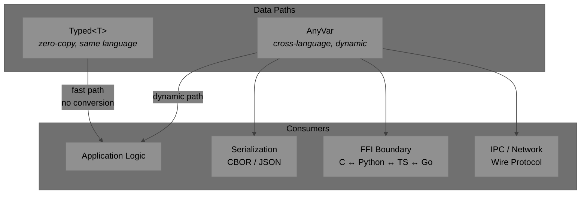

---

## 2. Type System

### Type Hierarchy

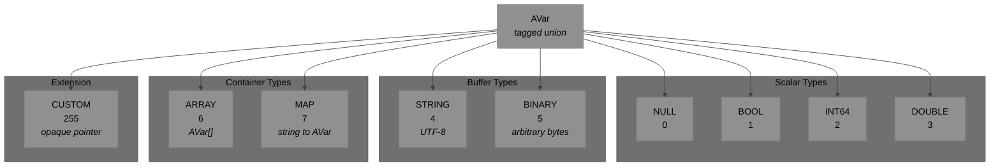

### Type Tags

| Tag | Name | Value | C Union Member | Size |
|---|---|---|---|---|
| `A_NULL` | No value | `0` | *(none)* | 0 |
| `A_BOOL` | Boolean | `1` | `bool b` | 1 byte |
| `A_INT64` | 64-bit integer | `2` | `int64_t i64` | 8 bytes |
| `A_DOUBLE` | 64-bit float | `3` | `double d` | 8 bytes |
| `A_STRING` | UTF-8 text | `4` | `str { data, len, owned }` | ptr + size_t + bool |
| `A_BINARY` | Byte buffer | `5` | `str { data, len, owned }` | ptr + size_t + bool |
| `A_ARRAY` | Variant array | `6` | `array { items, len }` | ptr + size_t |
| `A_MAP` | String→Variant map | `7` | `map { keys, values, len }` | 2 ptrs + size_t |
| `A_CUSTOM` | User extension | `255` | `void* custom` | ptr |

---

## 3. Architecture & C ABI

AnyVar separates into two stable layers:

- **Universal Handle** (`AVar`) — a fat pointer (backend vtable + opaque storage) that all application code touches. The default backend is selected automatically; existing call sites require no changes.
- **Backend** (`ABackend`) — a vtable struct implementing type operations for a specific format. The default backend uses the original native C struct layout (`AVarNative`).

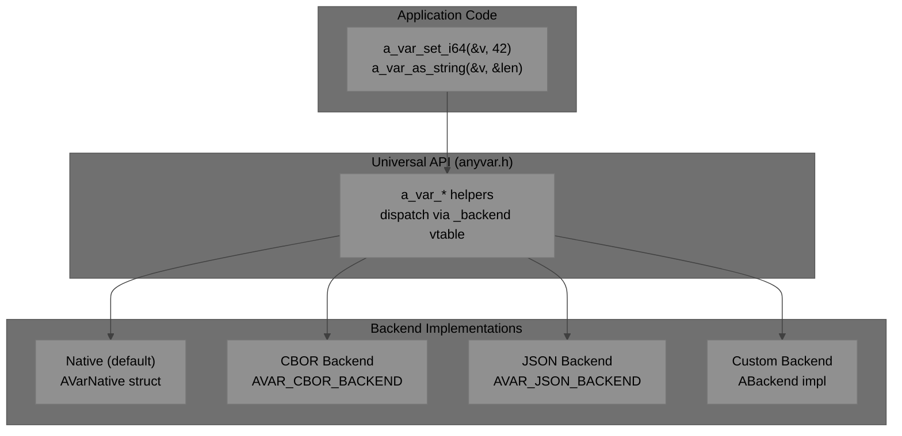

```c
typedef enum AVarType {
    A_NULL     = 0,
    A_BOOL     = 1,
    A_INT64    = 2,
    A_DOUBLE   = 3,
    A_STRING   = 4,    /* UTF-8 encoded text        */
    A_BINARY   = 5,    /* arbitrary byte buffer      */
    A_ARRAY    = 6,    /* array of AVar              */
    A_MAP      = 7,    /* string keys → AVar values  */
    A_CUSTOM   = 255   /* user-defined extension type */
} AVarType;
```

### 3.1 Universal Handle

```c
/* AVar — universal variant handle.
 * A fat pointer: backend vtable + opaque per-instance storage.
 * Zero-initialise and call any a_var_set_*() — the default backend
 * is selected automatically. No extra parameters required.
 */
typedef struct AVar {
    const ABackend* _backend;   /* NULL → AVAR_DEFAULT_BACKEND auto-selected */

    union {
        void*    _ptr;          /* heap-allocated backend data               */
        int64_t  _i64;          /* inline scalar — no heap allocation        */
        double   _d;            /* inline scalar — no heap allocation        */
        uint8_t  _buf[8];       /* small inline buffer                       */
    } _storage;
} AVar;
```

Fields prefixed `_` are private. Never access them directly; always use the helper API.

### 3.2 Backend Vtable

```c
/* ABackend — interface every backend must implement.
 * All helper functions dispatch through this vtable.
 */
typedef struct ABackend {
    const char* name;               /* e.g. "native", "cbor", "json"        */

    /* type introspection */
    AVarType    (*get_type)    (const AVar* v);

    /* scalar readers */
    bool        (*as_bool)     (const AVar* v);
    int64_t     (*as_i64)      (const AVar* v);
    double      (*as_double)   (const AVar* v);
    const char* (*as_string)   (const AVar* v, size_t* out_len);
    const void* (*as_binary)   (const AVar* v, size_t* out_len);

    /* scalar writers */
    void (*set_null)   (AVar* v);
    void (*set_bool)   (AVar* v, bool val);
    void (*set_i64)    (AVar* v, int64_t val);
    void (*set_double) (AVar* v, double val);
    void (*set_string) (AVar* v, const char* s, size_t len, bool copy);
    void (*set_binary) (AVar* v, const void* data, size_t len, bool copy);

    /* container readers */
    size_t (*array_len) (const AVar* v);
    AVar   (*array_get) (const AVar* v, size_t idx);
    size_t (*map_len)   (const AVar* v);
    AVar   (*map_get)   (const AVar* v, const char* key);

    /* lifecycle */
    void (*clear) (AVar* v);          /* reset + free owned resources       */
    AVar (*copy)  (const AVar* src);  /* deep copy, same backend            */

    /* serialization — NULL if unsupported */
    int (*encode_cbor) (const AVar* v, uint8_t* buf, size_t* len);
    int (*decode_cbor) (AVar* v, const uint8_t* buf, size_t len);
    int (*encode_json) (const AVar* v, char* buf, size_t* len);
    int (*decode_json) (AVar* v, const char* json);
} ABackend;

/* Built-in backends */
extern const ABackend AVAR_DEFAULT_BACKEND;  /* native C struct (default)  */
extern const ABackend AVAR_CBOR_BACKEND;     /* CBOR in-memory             */
extern const ABackend AVAR_JSON_BACKEND;     /* JSON in-memory             */
```

### 3.3 Default Backend Internal Type

The default backend stores data as `AVarNative` — the original tagged union C struct, now an implementation detail of `AVAR_DEFAULT_BACKEND`. Users working through the universal API never interact with this directly.

```c
/* AVarNative — internal representation of the default backend.
 * Identical to the pre-backend AVar layout; the C ABI is unchanged.
 * Language bindings that previously mapped to AVar now map here.
 */
typedef struct AVarNative {
    AVarType type;              /* tag (4 bytes; uint8_t for embedded)     */

    union {
        bool    b;              /* A_BOOL                                  */
        int64_t i64;            /* A_INT64                                 */
        double  d;              /* A_DOUBLE                                */

        struct {                /* A_STRING and A_BINARY                   */
            char*  data;        /* pointer to buffer (UTF-8 for string)   */
            size_t len;         /* length in bytes                        */
            bool   owned;       /* true = caller must free this memory    */
        } str;

        struct {                /* A_ARRAY                                 */
            struct AVarNative* items;
            size_t len;
        } array;

        struct {                /* A_MAP                                   */
            struct AVarNative* keys;    /* array of A_STRING variants     */
            struct AVarNative* values;  /* corresponding values           */
            size_t len;
        } map;

        void* custom;           /* A_CUSTOM — opaque pointer               */
    } u;
} AVarNative;
```

### Memory Layout (64-bit)

`AVar` universal handle (fat pointer — two machine words):


> **Size:** 16 bytes on 64-bit — two machine words.

`AVarNative` default backend internal struct:

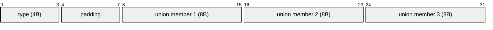

> **Typical size:** 24–32 bytes on 64-bit platforms (depending on alignment and whether `type` is `uint32_t` or `uint8_t`).

---

## 4. Layout Guarantees (ABI Stability)

- `AVar` (universal handle) is a standard-layout struct: two machine words (16 bytes on 64-bit). Its layout is fixed and C ABI stable.
- `AVarNative` (default backend internal type) uses standard C layout rules under `extern "C"`. It is a **standard-layout type** with the same ABI as the original `AVar` struct from v0.1.
- For maximum skinny/embedded use, `AVarNative` implementations MAY define `AVarType` as `uint8_t` and apply packing (`#pragma pack(8)` or `__attribute__((packed))`).
- **Never** access `_backend` or `_storage` on `AVar` directly. Never access `u` members of `AVarNative` unless the `type` field matches. Always use helper functions.

---

## 5. Ownership and Lifetime Rules

### Ownership Model

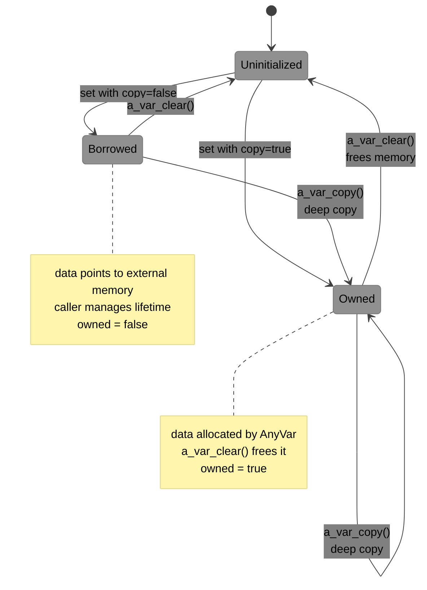

### Rules

1. The `owned` flag (in `str`) indicates whether the memory pointed to by `data` should be freed when the variant is destroyed.
2. For `array` and `map`: ownership is **recursive** — the container owns its child `AVar` items.
3. Default creation from native data SHOULD set `owned = false` (borrow semantics) unless the caller explicitly requests a copy.
4. Destruction function: `a_var_clear(AVar* v)` MUST free memory only when `owned == true` (or recursively for containers).
5. Embedded systems SHOULD support custom allocators via global hooks or per-variant context.

### Container Ownership (Recursive)

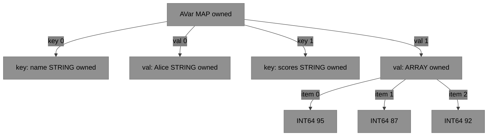

> `a_var_clear(&map)` recursively frees keys → values → array items.

---

## 6. Recommended Helper API (C Layer)

All functions dispatch through the `_backend` vtable. When `_backend` is `NULL` (zero-initialised `AVar`), `AVAR_DEFAULT_BACKEND` is selected automatically — **existing call sites require no changes.**

```c
/* ── Initialization ───────────────────────────────────────────────────── */
void a_var_init_null(AVar* v);               /* uses AVAR_DEFAULT_BACKEND  */
void a_var_init_with_backend(AVar* v,
                             const ABackend* backend); /* explicit opt-in  */

/* ── Scalar setters ───────────────────────────────────────────────────── */
void a_var_set_bool  (AVar* v, bool value);
void a_var_set_i64   (AVar* v, int64_t value);
void a_var_set_double(AVar* v, double value);

/* Buffer setters (copy=true → owned, copy=false → borrowed) */
void a_var_set_string(AVar* v, const char* str, bool copy);
void a_var_set_binary(AVar* v, const void* data, size_t len, bool copy);

/* ── Scalar readers ───────────────────────────────────────────────────── */
AVarType    a_var_type     (const AVar* v);
bool        a_var_as_bool  (const AVar* v);
int64_t     a_var_as_i64   (const AVar* v);
double      a_var_as_double(const AVar* v);
const char* a_var_as_string(const AVar* v, size_t* out_len); /* UTF-8 */
const void* a_var_as_binary(const AVar* v, size_t* out_len);

/* ── Lifecycle ────────────────────────────────────────────────────────── */
void a_var_clear(AVar* v);           /* reset + free owned resources       */
AVar a_var_copy (const AVar* src);   /* deep copy, same backend            */

/* ── Cross-backend conversion ─────────────────────────────────────────── */
AVar a_var_convert(const AVar* src, const ABackend* dst_backend);
```

**Default backend — no new params needed:**

```c
AVar v;
a_var_init_null(&v);        /* or simply: AVar v = {0}; */
a_var_set_i64(&v, 42);
printf("%lld\n", a_var_as_i64(&v));
a_var_clear(&v);
```

**Explicit backend selection (advanced):**

```c
AVar v;
a_var_init_with_backend(&v, &AVAR_CBOR_BACKEND);
a_var_set_i64(&v, 42);
a_var_clear(&v);
```

Each language binding MUST provide idiomatic equivalents (e.g., `to_variant()`, `from_variant()`).

### Language Binding Pattern

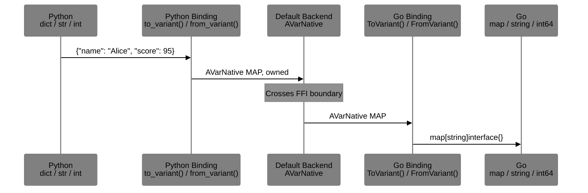

---

## 7. Usage Guidelines

### When to Use Each Data Path

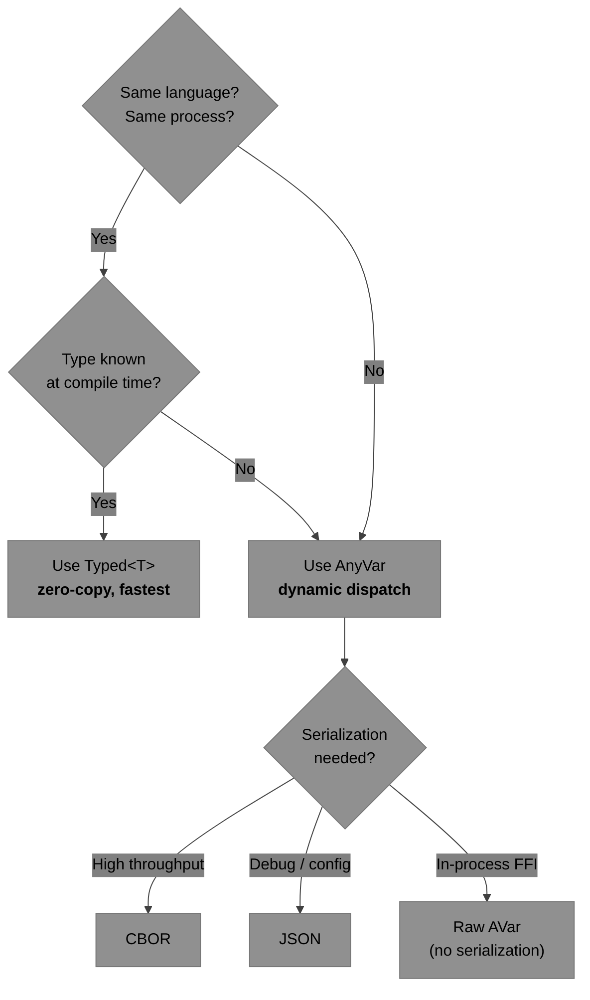

### Guidelines

| Scenario | Recommendation |
|---|---|
| Hot loop, same language | **Typed path** — avoid AnyVar entirely |
| Cross-language FFI | **AnyVar** via C ABI |
| Wire protocol / IPC | **AnyVar** → CBOR backend |
| Configuration files | **AnyVar** → JSON backend |
| User-defined complex types | **A_CUSTOM** + type registry |
| Custom wire format | **AnyVar** + custom `ABackend` impl |

---

## 8. Serialization Recommendations

| Format | Use Case | Pros | Cons |
|---|---|---|---|
| **CBOR** | Wire format (default) | IETF standard (RFC 8949), compact, self-describing, deterministic mode, semantic tags | Binary (not human-readable) |
| **JSON** | Debug / config | Human-readable, universal | Verbose, slow for high throughput |

Serialization is a backend capability. The CBOR and JSON backends implement `encode_cbor`/`decode_cbor` and `encode_json`/`decode_json` in their `ABackend` vtable respectively. The native default backend delegates to standalone encode/decode functions.

### Serialization Flow

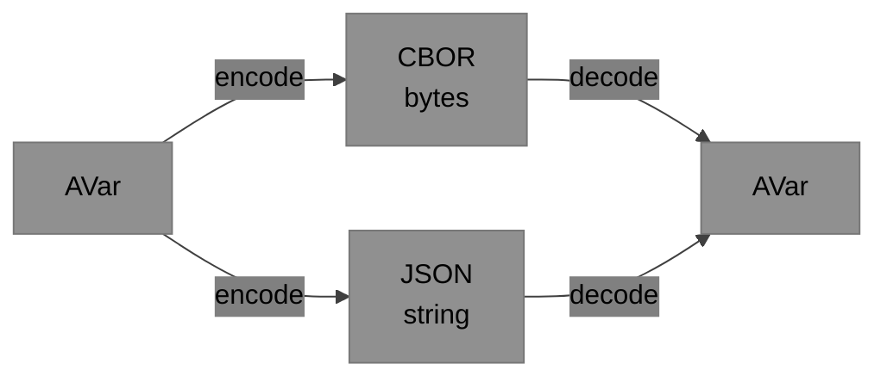

---

## 9. Embedded Considerations

### Platform Configuration

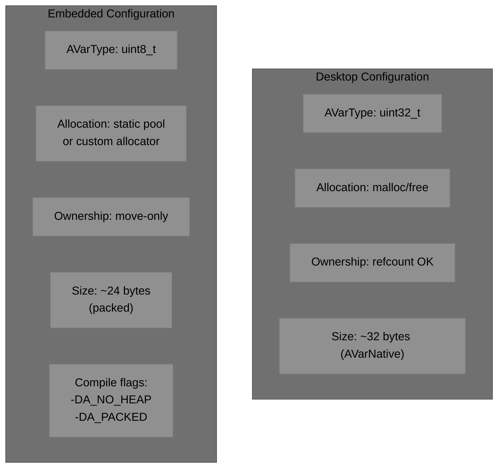

### Compile-Time Flags

| Flag | Effect |
|---|---|
| `A_NO_HEAP` | Disable heap allocation; use static pools only |
| `A_PACKED` | Apply struct packing for minimal size |
| `A_TYPE_U8` | Use `uint8_t` for `AVarType` instead of `uint32_t` |
| `A_CUSTOM_ALLOC` | Enable custom allocator hooks |
| `A_NO_MAP` | Disable A_MAP type (saves code size on tiny targets) |

---

## 10. Non-Goals

- Full GObject-style dynamic type system (too heavy)
- Built-in transformation / collection functions (keep it skinny)
- Language-specific features (e.g., no C++ `std::variant` in the ABI layer)
- Garbage collection or cycle detection

---

## 11. Implementation Roadmap

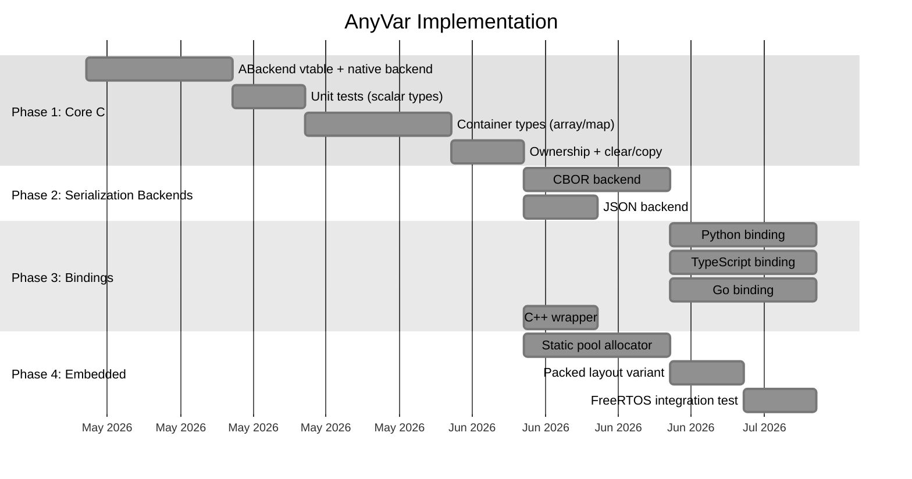

### Phase Summary

| Phase | Deliverables | Dependencies |
|---|---|---|
| **1. Core C** | `AVar` handle, `ABackend` vtable, native backend (`AVarNative`), scalar + container types, ownership | None |
| **2. Serialization Backends** | CBOR backend, JSON backend | Phase 1 |
| **3. Bindings** | Python, TypeScript, Go, C++ wrappers | Phase 1 (Phase 2 for serialization tests) |
| **4. Embedded** | Static allocator, packed layout, RTOS integration | Phase 1 |

---

## 12. License

AnyVar is intended to be open source (**MIT/Apache 2.0** recommended).

---

> This specification is standalone. All language implementations (C/C++, Python, TypeScript, Go, etc.) interact through the universal `AVar` handle and `a_var_*` helper API. Cross-FFI bindings map to/from `AVarNative` for the default backend; alternative backends implement `ABackend` and integrate transparently.
>
> **Next steps:** Formalize `ABackend` vtable contract, provide reference implementations of the native and CBOR backends in C, add alignment/packing examples for embedded targets.
>
> Contributions and feedback welcome.
