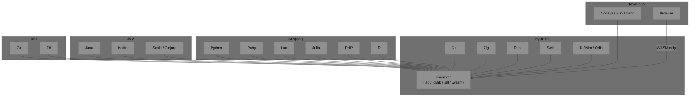
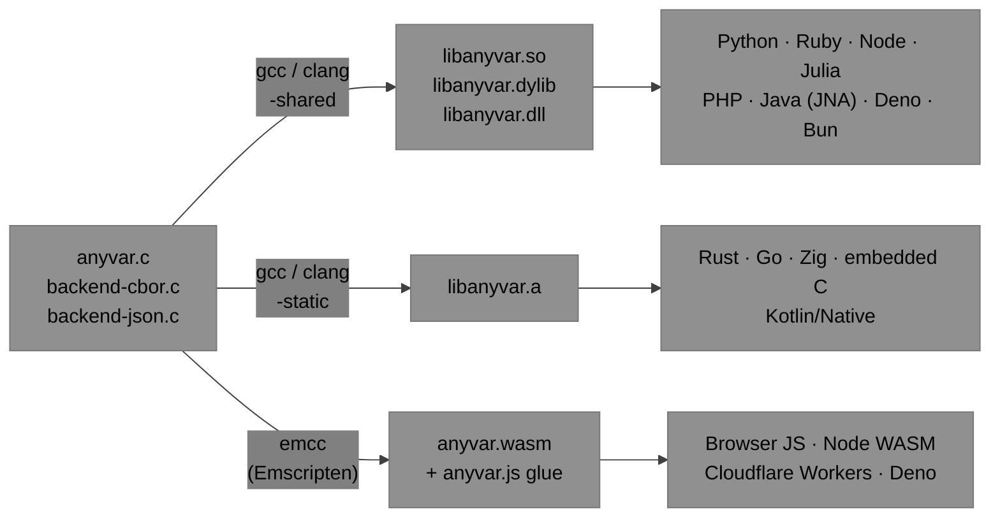
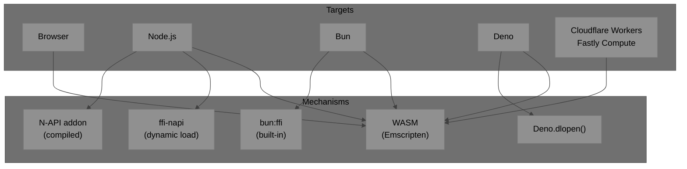

# AnyVar C Library — Language Integration Guide

A pure C99 shared library is the most portable way to expose AnyVar. Any language that runs on a platform with an OS loader can call it — which is essentially every mainstream language in existence.

---

## Why C?



The C ABI is the universal lingua franca. Every language runtime knows how to call a C function. No other language has this property.

---

## What Makes AnyVar Universally Linkable

| Property | Detail |
|---|---|
| **Pure C99** | No C++ name mangling, no exceptions, no RTTI |
| **`extern "C"` guards** | Safe to `#include` from C++ |
| **`ANYVAR_API` visibility** | `__declspec(dllexport)` on Windows, `visibility("default")` on Unix |
| **No global state** | Thread-safe, embeddable, no init required |
| **Pointer-based API** | `AVar*` everywhere; avoids struct-return edge cases in some FFIs |
| **Standard-layout struct** | `AVar` maps predictably in every FFI type system |
| **No mandatory dependencies** | Core library links against nothing but libc |

---

## Repository Layout

```
anyvar/
├── include/
│   └── anyvar.h           # single public header — types + inline helpers
├── src/
│   ├── anyvar.c           # non-inline: copy, convert, string/array/map alloc
│   ├── backend-cbor.c     # CBOR backend (wraps tinycbor)
│   └── backend-json.c     # JSON backend (wraps cJSON)
├── bindings/
│   ├── python/            # cffi descriptor + avar.py
│   ├── go/                # cgo binding + avar.go
│   ├── typescript/        # WASM glue + avar.ts (or N-API addon)
│   ├── swift/             # module.modulemap + AVar.swift
│   └── rust/              # build.rs (bindgen) + lib.rs
├── tests/
│   └── test-native.c
├── CMakeLists.txt
└── Taskfile.yml
```

---

## Build Targets



---

## Language Binding Map

### Systems Languages — Direct C Header Import

| Language | Mechanism | Notes |
|---|---|---|
| **C++** | `#include "anyvar.h"` | `extern "C"` already in header |
| **Swift** | Bridging header | Import directly as a module |
| **Zig** | `@cImport(@cInclude("anyvar.h"))` | Zero overhead |
| **Rust** | `bindgen` → `bindings.rs` | Wrap in safe newtype |
| **D** | `extern (C)` declarations | Manual or dpp tool |
| **Nim** | `{.importc.}` pragmas | |
| **Odin** | `foreign` blocks | |
| **V (vlang)** | `#flag` + `#include` | |

### Scripting Languages — Dynamic FFI

| Language | Mechanism | Notes |
|---|---|---|
| **Python** | `cffi` (preferred) or `ctypes` | `cffi` handles structs cleanly |
| **Ruby** | `ffi` gem | Very similar to Python cffi |
| **Lua** | LuaJIT `ffi.cdef` | Bare-metal speed |
| **Julia** | `ccall()` built-in | First-class C interop |
| **PHP** | `FFI` extension (7.4+) | |
| **R** | `Rcpp` or `.Call()` | |
| **Haskell** | `Foreign.C` / `FFI` pragma | |
| **OCaml** | `ctypes` library | |
| **Erlang / Elixir** | NIFs | Thin C wrapper around AVar |
| **Racket** | `ffi/unsafe` | |
| **Common Lisp** | `CFFI` | |
| **Perl** | `Inline::C` / `XS` | |
| **Tcl** | `critcl` | |

### JVM Languages — JNA / Project Panama

| Language | Mechanism | Notes |
|---|---|---|
| **Java** | JNA (easiest) or Project Panama | Panama is zero-copy in Java 22+ |
| **Kotlin** (JVM) | JNA via Java interop | |
| **Kotlin/Native** | `kotlinx.cinterop` | Direct C headers, same as Zig/Swift |
| **Scala** | JNA via Java interop | |
| **Clojure** | JNA via Java interop | |

### .NET Languages — P/Invoke

| Language | Mechanism |
|---|---|
| **C#** | `[DllImport("libanyvar")]` |
| **F#** | `[<DllImport>]` attribute |
| **VB.NET** | `Declare Function` |
| **PowerShell** | `Add-Type` with P/Invoke |

### Scientific / Numerical

| Language | Mechanism |
|---|---|
| **MATLAB** | `loadlibrary("libanyvar", "anyvar.h")` |
| **Mathematica** | `LibraryLink` |
| **Fortran** | `ISO_C_BINDING` (C99 interop standard) |

---

## JavaScript & Node.js



| Option | Portability | Performance | Effort |
|---|---|---|---|
| **WASM** (Emscripten) | Node + browser + edge | Good; WASM linear memory | Build step required |
| **ffi-napi** | Node only | Fast; direct `.dylib` | Minimal — no C wrapper |
| **N-API addon** | Node only | Fastest; native call | Requires C++ wrapper |
| **bun:ffi** | Bun only | Very fast | Near-zero |
| **Deno.dlopen** | Deno only | Fast | Minimal |

**Recommendation:** WASM as the primary target for maximum reach. `ffi-napi` for a fast Node-only proof of concept.

---

## Key Binding Examples

### Python (cffi)

```python
from cffi import FFI
ffi = FFI()
ffi.cdef("""
    typedef enum { A_NULL=0, A_BOOL=1, A_INT64=2, A_DOUBLE=3,
                   A_STRING=4, A_BINARY=5, A_ARRAY=6, A_MAP=7,
                   A_BACKEND=255 } AVarType;
    typedef struct { /* opaque — sized by cffi */ } AVar;
    void    a_var_init_null(AVar* v);
    void    a_var_set_i64(AVar* v, int64_t val);
    int64_t a_var_as_i64(const AVar* v);
    void    a_var_clear(AVar* v);
""")
lib = ffi.dlopen("libanyvar.dylib")
v = ffi.new("AVar *")
lib.a_var_set_i64(v, 42)
print(lib.a_var_as_i64(v))  # 42
lib.a_var_clear(v)
```

### Go (CGo)

```go
// #cgo LDFLAGS: -lanyvar
// #include "anyvar.h"
import "C"

func main() {
    var v C.AVar
    C.a_var_set_i64(&v, 42)
    fmt.Println(int64(C.a_var_as_i64(&v))) // 42
    C.a_var_clear(&v)
}
```

### Rust (bindgen)

```rust
// build.rs generates bindings.rs from anyvar.h
// Safe wrapper:
pub struct AVar(sys::AVar);
impl AVar {
    pub fn new() -> Self { let mut v = sys::AVar::default(); unsafe { sys::a_var_init_null(&mut v) }; Self(v) }
    pub fn set_i64(&mut self, val: i64) { unsafe { sys::a_var_set_i64(&mut self.0, val) } }
    pub fn as_i64(&self) -> i64 { unsafe { sys::a_var_as_i64(&self.0) } }
}
impl Drop for AVar { fn drop(&mut self) { unsafe { sys::a_var_clear(&mut self.0) } } }
```

### Node.js (ffi-napi)

```js
import ffi from 'ffi-napi';
const lib = ffi.Library('./libanyvar', {
    a_var_set_i64: ['void',  ['pointer', 'int64']],
    a_var_as_i64:  ['int64', ['pointer']],
    a_var_clear:   ['void',  ['pointer']],
});
const v = Buffer.alloc(32);   // sizeof(AVar) on 64-bit
lib.a_var_set_i64(v, 42n);
console.log(lib.a_var_as_i64(v)); // 42n
lib.a_var_clear(v);
```

---

## Summary

The C library is the right foundation because:

1. **One implementation, every language** — write AnyVar once in C; every language listed above can call it without rewriting the core logic.
2. **Type-sentinel AVar is FFI-ideal** — standard layout, predictable size (~32B), first field is always readable, zero hidden allocations on the native path.
3. **Three build artifacts cover everything** — `.a` for static linking, `.so`/`.dylib` for dynamic FFI, `.wasm` for JS/browser.
4. **Backends are opt-in** — most FFI callers only need the native path; CBOR/JSON backends are linked only when needed.
